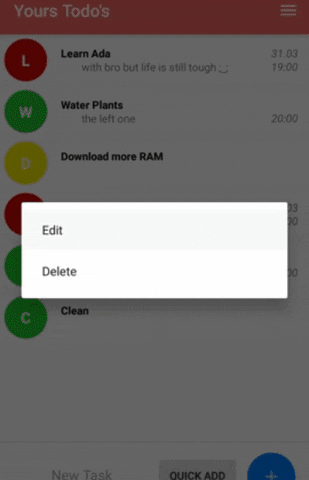

# Yours Todo's
Todo App written in Kotlin for Android

## About 
It's my fourth project. This time the task was to build simple Todo app that uses EditText and Button and proper layout.
Additionaly user should be able to delete a task and app should remember added tasks on screen rotation. 
Disclaimer: For extra points - more functionality the better.

## App Featuring
So besides what was necessery for max points I decided to:
* Implement whole database to the project to save those todo's when user quits the app (so it's actually any useful)
* Add priorities with colors and icon based on Title
* Edition of tasks
* Sorting (on date added / dated to do / title / priority)
* Descriptions to the tasks
* Custom app colors and icon
* Quick Add

## Todo:
* Change Date from being a String into a Date (to make date sort work properly)
* Fix Queries passing var String problem (because I dislike my workaround)

